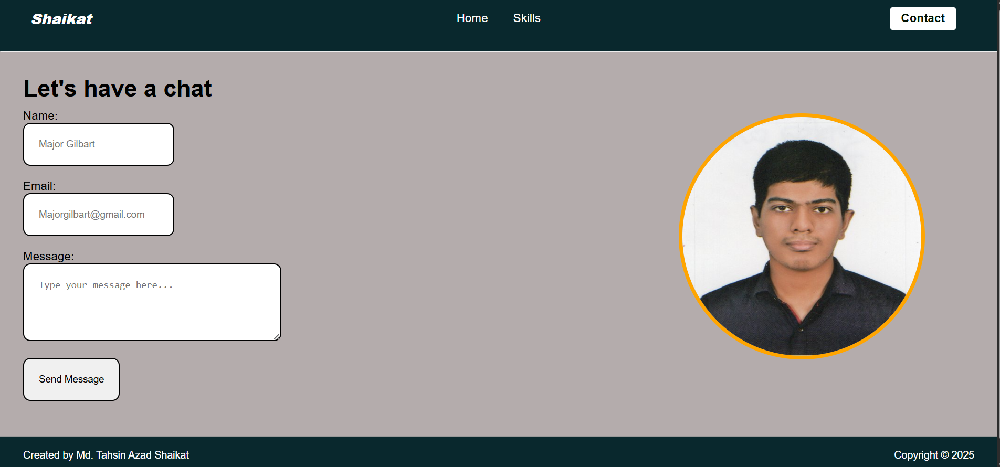

# My Portfolio Website


A simple webpage built with HTML, CSS


## Technologies Used

- HTML5
- CSS3
- [FormSubmit](https://formsubmit.co) – third-party service for handling contact form submissions


##  Contact Form Preview  

Here’s how the contact form looks in the portfolio:  



## Installation

No installation needed! Simply open `index.html`. Also can open in github pages


## Project Structure
```
personal-website/
├── index.html 
├── skill.html
├── contact.html
├── images/
│ ├── styles.css
├── images/
│ ├── Md_Tahsin_Azad_Shaikat.png
│ ├── Screenshot.png
│ ├── contact_screenshot.png
└── readme.md
```

## Author

**Md Tahsin Azad Shaikat**

Web developer focused on front-end especially back-end which is Django framework, with basic skills in IoT and robotics.
🔗 [LinkedIn](https://www.linkedin.com/in/mdtahsinazad020/)
